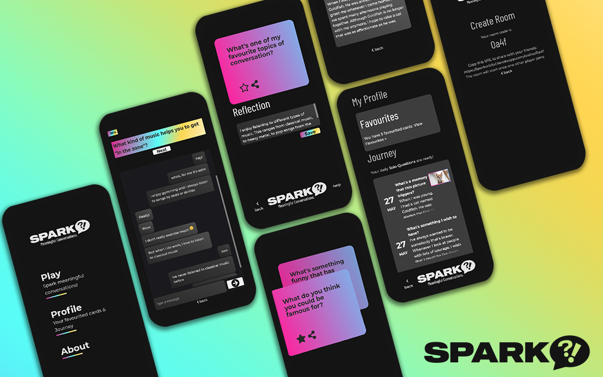

>SPARK is an app about creating meaningful conversations using the power of questions. Have a chat, laugh, learn, and more with our variety of game modes!

SPARK is a project created for National University of Singapore (NUS) Orbital 2021.

This repository contains the frontend for SPARK. Our backend repository is at [spark-backend](https://github.com/tanruiquan/spark-backend)

Spark was created by [@qreoct](https://github.com/qreoct) and [@tanruiquan](https:github.com/tanruiquan)

## Features

SPARK is an app about creating meaningful conversations using the power of questions. 

- **Solo Mode** Daily self-reflection and journalling with our thought-provoking questions
- **Group Mode** Spice up your gatherings with Icebreakers, Deep Questions, and many more!
- **Online Mode** Engage in conversations with friends and strangers with realtime chat! 

Check out our demo [here](https://sparkorbital.herokuapp.com)!

## Development

SPARK was written in React.

`npm run start` Launch local build

`npm run build` Compile

`npm run test` Run unit tests

`npm run cy:test` Run E2E tests using Cypress

## Acknowledgements

Images using [Unsplash API](https://unsplash.com/developers), Icons from Font Awesome.

This project was bootstrapped with [Create React App](https://github.com/facebook/create-react-app).
